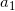
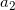

# Ti_BTree

In computer science, a B-tree is a self-balancing tree data structure that maintains sorted data and allows searches, sequential access, insertions, and deletions in logarithmic time. The B-tree is a generalization of a binary search tree in that a node can have more than two children. Unlike other self-balancing binary search trees, the B-tree is well suited for storage systems that read and write relatively large blocks of data, such as discs. It is commonly used in databases and file systems.

  .

---

## Definition

According to Knuth's definition, a B-tree of order m is a tree which satisfies the following properties:

1. Every node has at most <i>m</i> children.
2. Every non-leaf node (except root) has at least ⌈<i>m/2</i>⌉ child nodes.
3. The root has at least two children if it is not a leaf node.
4. A non-leaf node with k children contains <i>k − 1</i> keys.
5. All leaves appear in the same level and carry no information.

Each internal node’s keys act as separation values which divide its subtrees. For example, if an internal node has 3 child nodes (or subtrees) then it must have 2 keys:  and . All values in the leftmost subtree will be less than , all values in the middle subtree will be between  and , and all values in the rightmost subtree will be greater than .