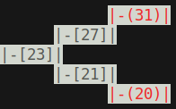
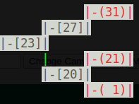
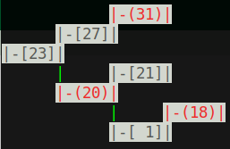
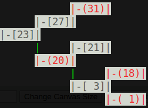
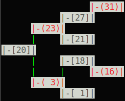
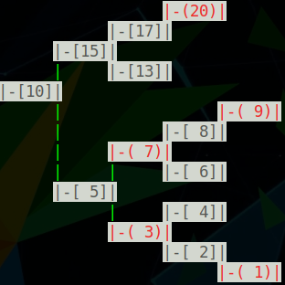
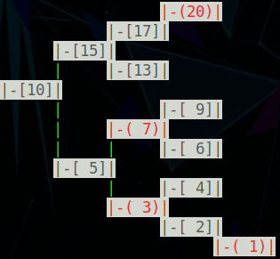
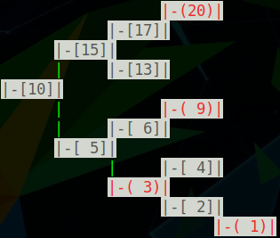
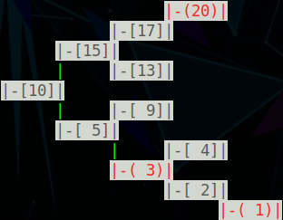

# Ti_RBTree

A <b>red–black</b> tree is a kind of self-balancing binary search tree in computer science. Each node of the binary tree has an extra bit, and that bit is often interpreted as the color (red or black) of the node. These color bits are used to ensure the tree remains approximately balanced during insertions and deletions.

---

## Properties
In addition to the requirements imposed on a binary search tree the following must be satisfied by a red–black tree:

1. Each node is either red or black.
2. The root is black. This rule is sometimes omitted. Since the root can always be changed from red to black, but not necessarily vice versa, this rule has little effect on analysis.
3. All leaves (NIL) are black.
4. If a node is red, then both its children are black.
5. Every path from a given node to any of its descendant NIL nodes contains the same number of black nodes.

---

## How to use

```cpp
#include "Ti_RBTree.hpp" // To include Red Black Tree structure

Ti_RBTree<int> RBTree; // To initialize Red Black Tree

RBTree.AddElement(key); // To insert element

RBTree.DeleteElement(key); // To delete element

RBTree.Ti_Show(); // To "beautiful" print

A.ShowUD(); // To Up Down print

A.ShowLR(); // To Left Right print

A.ShowDU(); // To Down Up print
```

---
## How insertion works

#### Initial state of the tree



#### Inserting 1



#### Inserting 18



#### Inserting 3



#### Inserting 16




---
## How removing works

#### Initial state of the tree



#### Removing 8



#### Removing 7



#### Removing 6

