# Ti_AVL_Tree
AVL Tree Data Structure

---

## Definition

<b>AVL tree</b> is a <i>binary search tree</i> in which the difference of heights of left and right subtrees of any node is less than or equal to one. The technique of balancing the height of binary trees was developed by <b>A</b>delson, <b>V</b>elskii, and <b>L</b>andi and hence given the short form as AVL tree or Balanced Binary Tree.

<p align="center">
  
</p>

---

## Properties

Balance factors can be kept up-to-date by knowing the previous balance factors and the change in height – it is not necessary to know the absolute height. For holding the AVL balance information in the traditional way, two bits per node are sufficient. However, later research showed if the AVL tree is implemented as a rank balanced tree with delta ranks allowed of 1 or 2 – with meaning "when going upward there is an additional increment in height of one or two", this can be done with one bit.

The height  of an AVL tree with 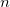 nodes lies in the interval:

<p align="center">
  
</p>


with the golden ratio φ := 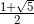 ≈ 1.618, c := 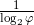 ≈ 1.44,  and  b := 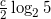 – 2 ≈ –0.328. This is because an AVL tree of height h contains at least  – 1 nodes where {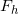} is the Fibonacci sequence with the seed values 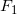 = 1, 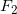 = 1.


| Operation     | Average       | Worst case   |
| ------------- | ------------- | ------------ |
| Space         | **O(n)**      | **O(n)**     |
| Search        | **O(log n)**  | **O(log n)** |
| Insert        | **O(log n)**  | **O(log n)** |
| Delete        | **O(log n)**  | **O(log n)** |


---

## Usage

```cpp
#include "Ti_AVL_Tree.hpp" // To include AVL Tree structure

Ti_AVL_Tree AVLTree; // To initialize AVL Tree

AVLTree.AddElement(key); // To insert element

AVLTree.DeleteElement(key); // To delete element

AVLTree.Ti_Show(); // To "beautiful" print

AVLTree.ShowUD(); // To Up Down print

AVLTree.ShowLR(); // To Left Right print

AVLTree.ShowDU(); // To Down Up print

```

---

## Insertion examples

Initial state of the tree

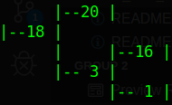

Inserting <b>5</b>

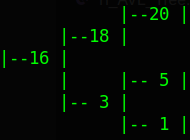

Inserting <b>14</b>

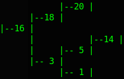

Inserting <b>7</b>

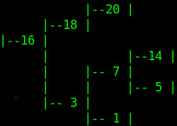

Inserting <b>12</b>


---

## Removing examples

Initial state of the tree

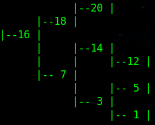

Removing <b>7</b>

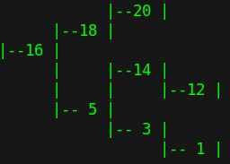

Removing <b>20</b>

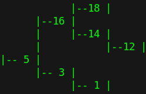