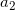

# Ti_BTree

In computer science, a <b>B-tree</b> is a self-balancing tree data structure that maintains sorted data and allows searches, sequential access, insertions, and deletions in logarithmic time. The B-tree is a generalization of a binary search tree in that a node can have more than two children. Unlike other self-balancing binary search trees, the B-tree is well suited for storage systems that read and write relatively large blocks of data, such as discs. It is commonly used in databases and file systems.

  .

---

## Definition
<dl>
According to Knuth's definition, a B-tree of order m is a tree which satisfies the following properties:

1. Every node has at most <i>m</i> children.
2. Every non-leaf node (except root) has at least ⌈<i>m/2</i>⌉ child nodes.
3. The root has at least two children if it is not a leaf node.
4. A non-leaf node with k children contains <i>k − 1</i> keys.
5. All leaves appear in the same level and carry no information.

Each internal node’s keys act as separation values which divide its subtrees. For example, if an internal node has 3 child nodes (or subtrees) then it must have 2 keys:  and . All values in the leftmost subtree will be less than , all values in the middle subtree will be between  and , and all values in the rightmost subtree will be greater than .

<dt>Internal nodes</dt>

<dd>Internal nodes are all nodes except for leaf nodes and the root node. They are usually represented as an ordered set of elements and child pointers. Every internal node contains a <b>maximum</b> of <i>U</i> children and a <b>minimum</b> of <i>L</i> children. Thus, the number of elements is always 1 less than the number of child pointers (the number of elements is between <i>L−1</i> and <i>U−1</i>). <i>U</i> must be either <i>2L</i> or <i>2L−1</i>; therefore each internal node is at least half full. The relationship between <i>U</i> and <i>L</i> implies that two half-full nodes can be joined to make a legal node, and one full node can be split into two legal nodes (if there’s room to push one element up into the parent). These properties make it possible to delete and insert new values into a B-tree and adjust the tree to preserve the B-tree properties.</dd>

<dt>The root node</dt>

<dd>The root node’s number of children has the same upper limit as internal nodes, but has no lower limit. For example, when there are fewer than L−1 elements in the entire tree, the root will be the only node in the tree with no children at all.</dd>

<dt>Leaf nodes</dt>

<dd>In Knuth's terminology, leaf nodes do not carry any information. The internal nodes that are one level above the leaves are what would be called "leaves" by other authors: these nodes only store keys (at most m-1, and at least m/2-1 if they are not the root) and pointers to nodes carrying no information.</dd>

A B-tree of depth n+1 can hold about U times as many items as a B-tree of depth n, but the cost of search, insert, and delete operations grows with the depth of the tree. As with any balanced tree, the cost grows much more slowly than the number of elements.

Some balanced trees store values only at leaf nodes, and use different kinds of nodes for leaf nodes and internal nodes. B-trees keep values in every node in the tree except leaf nodes.
</dl>